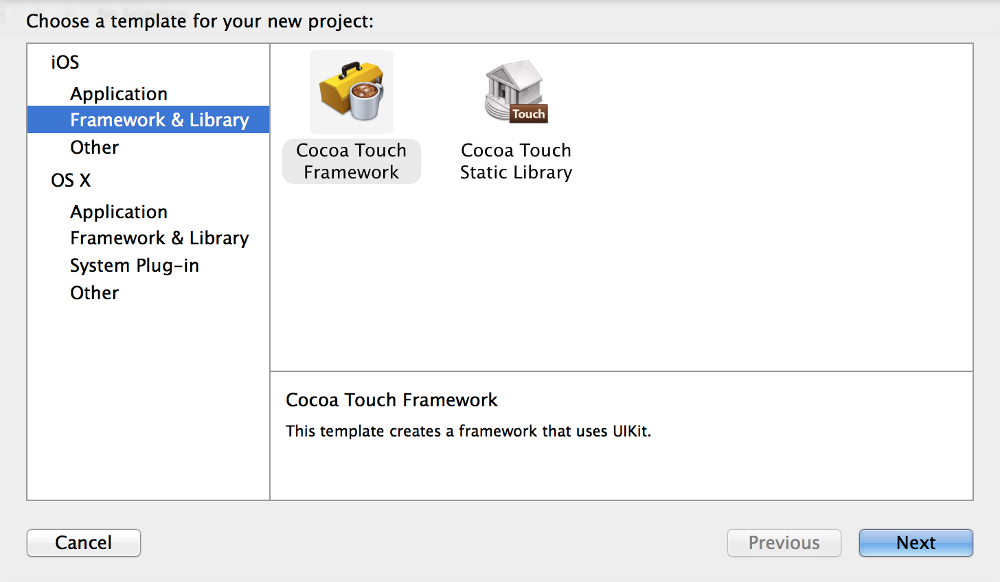
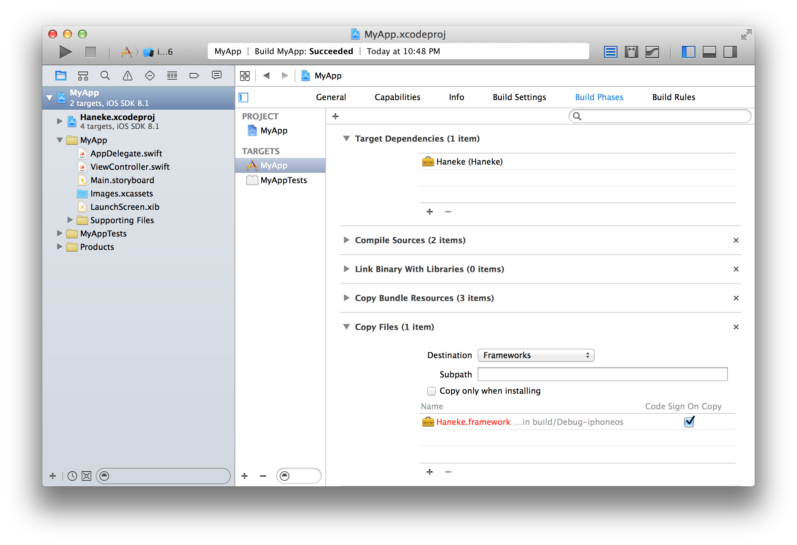

# Building *Swift* frameworks

#### @hpique

---

> iOS developers can now create dynamic frameworks. Frameworks are a collection of code and resources to encapsulate functionality that is valuable across multiple projects.
-- [New Features in Xcode 6](https://developer.apple.com/library/ios/documentation/DeveloperTools/Conceptual/WhatsNewXcode/Articles/xcode_6_0.html)

---

## No more header tinkering!


---

## Creating a new framework



---

# Swift frameworks

* *CAN* mix-and-match Objective-C code
* *CAN* import all Objective-C system frameworks (e.g., UIKit)
* *CAN* import C libraries defined as modules (e.g., Dispatch)
* *CAN'T* use other libraries directly (e.g., CommonCrypto)

See: *[Swift and Objective-C in the Same Project](https://developer.apple.com/library/ios/documentation/swift/conceptual/buildingcocoaapps/MixandMatch.html#//apple_ref/doc/uid/TP40014216-CH10-XID_77)*

---

## What about *static libraries*?

---

> Xcode does not support building static libraries that include Swift code.
-- [Xcode 6.0 Beta 5 release notes](http://mazur.me/SwiftInFlux/docs/beta5.pdf)

---

# Let's try anyway!


Add a Swift file to a static library and build:

```
error: /Applications/Xcode.app/Contents/Developer/Toolchains/
XcodeDefault.xctoolchain/usr/bin/libtool:
unknown option character `X' in: -Xlinker
```
<br/>


Follow: *[http://stackoverflow.com/q/24020986/143378](http://stackoverflow.com/q/24020986/143378)*

---

# Using frameworks

---

# No *CocoaPods*


--- 

# *Step 1*: Add the framework as a subproject

Drag the framework project into your app project.

---

# *Step 2*: Set the framework as build dependency

1. Select your project and then your app target
2. Open the *Build Phases* panel
3. Expand *Target Dependencies*
4. Click *+* and select the framework

---

# *Step 3*: Copy the framework during build

From *Build Phases*:

1. Click on the *+* button at the top left of the panel and select *New Copy Files Phase*
2. Set *Destination* to *Frameworks*
3. Click *+* and select the framework

---



---
# Finally


```Swift
import MyFramework
```


---

# Access control

---

> [I]f you are writing a single-target app, you may not need to specify explicit access control levels at all.
-- [The Swift Programming Language](https://developer.apple.com/library/mac/documentation/Swift/Conceptual/Swift_Programming_Language/AccessControl.html)

---

## But you're writing a framework


---

## Access levels

* *Public*: accessible everywhere
* *Internal* (default): accessible within any source file from the defining module, but not outside of that module
* *Private*: accessible only within its own defining source file

---

## We kind* of had that already

In Objective-C land:

* *Public*: declared in public headers
* *Internal*: declared in project headers
* *Private*: declared in implementation files

\* (without enforcing access control)

---

### *Guiding principle*


### No entity can be defined in terms of another entity that has a lower (more restrictive) access level

--- 

# BAD 

```Swift
private struct PrivateThing {}

struct InternalThing {}

public struct PublicThing {

	let t1 : PrivateThing
	public let t2 : InternalThing
	func doSomething(t : PrivateThing) {}
	public func doSomethingElse(t : InternalThing) {}

}
```

---

# Example

Consider a framework with a public function that fetches a string asynchronously. 

The function returns a *Fetch* object that can have a callback for success.

```Swift
let fetch = fetchSomething().onSuccess { println($0) }
```

Let's define the access levels of the *Fetch* class.

---

```Swift
class Fetch {
        
    var onSuccess : ((String) -> ())?
    
    var state : FetchState = FetchState.Pending
        
    func onSuccess(onSuccess : ((String) -> ())) -> Self {
        self.onSuccess = onSuccess
        switch self.state {
        case FetchState.Success(let value):
            onSuccess(value)
        default: break
        }
        return self
    }
        
    func succeed(value : String) {
        self.state = FetchState.Success(value)
        self.onSuccess?(value)
    }    
}
```


---

```Swift
public class Fetch {
        
    private var onSuccess : ((String) -> ())?
    
    private var state : FetchState = FetchState.Pending
        
    public func onSuccess(onSuccess : ((String) -> ())) -> Self {
        self.onSuccess = onSuccess
        switch self.state {
        case FetchState.Success(let value):
            onSuccess(value)
        default: break
        }
        return self
    }
        
    func succeed(value : String) {
        self.state = FetchState.Success(value)
        self.onSuccess?(value)
    }    
}
```

--- 

# Namespacing

---

> Namespacing is implicit in swift, all classes (etc) are implicitly scoped by the module (Xcode target) they are in. no class prefixes needed
-- [Chris Lattner](https://twitter.com/clattner_llvm/status/474730716941385729)

---


---

# Framework namespace

The framework name *is* the namespace. 

When importing a framework types can be accessed *implicitly* or *explicitly*.

---

# Fun with namespaces

Consider: 

A framework *FrameworkA* that defines a public type *Thing*.

An app *MyApp* that imports *FrameworkA*.

---

```Swift
import FrameworkA

let a : FrameworkA.Thing?
let t : Thing?
```

<br>

The two variables have the same type.

---

```Swift
import FrameworkA

public class Thing { } 

let a : FrameworkA.Thing?
let t : Thing?
let t2 : MyApp.Thing?
```

<br>

What is the type of *t*?

---

# Namespace conflict


What if *MyApp* also imports a *FrameworkB* that also defines a public type *Thing*?

```Swift
import FrameworkA
import FrameworkB

let a : Thing?
```

We get a nice error.

---

```
'Thing' is ambiguous for type lookup in this context
        let t1 : Thing? = nil
                ^~~~~
FrameworkA.Thing:1:7: note: found this candidate
class Thing
      ^
FrameworkB.Thing:1:7: note: found this candidate
class Thing
      ^
```

---

Solution: use fully qualified names.

```Swift
import FrameworkA
import FrameworkB

public class Thing { } 

let a : FrameworkA.Thing?
let t : Thing?
let b : FrameworkB.Thing?
```

<br>

*t* is of type *MyApp.Thing*.

---

# Namespace shenanigans


What if *FrameworkB*  also defines a public type named... 
<br>
*FrameworkA*
<br>
?


---

```Swift
import FrameworkA
import FrameworkB

let a : FrameworkA.Thing?
let b : FrameworkB.Thing?
```

We get a misleading error: `'Thing' is not a member type of 'FrameworkA'`

---

Workaround: define a *typealias* somewhere else in *MyApp*.

```Swift
import FrameworkA

typealias ThingA = Thing
```

Then:

```Swift
import FrameworkA
import FrameworkB

let a : ThingA?
let b : FrameworkB.Thing?
```

---

# Best practices

*Limit the scope** of types whenever possible.

Even more so for *public* types.

Don't define a type named like the framework (Haneke oops!).


<br>

#### *(this is always a good practice)


---

# Limiting the scope

---

# BAD

```Swift
public static let ErrorDomain = "io.haneke"
```

# *GOOD*

```Swift
public struct HanekeGlobals {
	public static let ErrorDomain = "io.haneke"
}
```
---

# BAD

```Swift
public enum ScaleMode {
	case Fill
	case AspectFit
    case AspectFill
}

public struct ImageResizer {
        
    public let scaleMode: ScaleMode
    
}
```

---

# *GOOD*

```Swift

public struct ImageResizer {
        
	public enum ScaleMode {
		case Fill
		case AspectFit
    	case AspectFill
	}
	
    public let scaleMode: ScaleMode
    
}
```

---

# What about generics?

Generic types can't define static types. This fails to compile:

```Swift
public class NetworkFetcher<T> {

	public enum ErrorCode : Int {
    	case InvalidData = -400
        case MissingData = -401
        case InvalidStatusCode = -402
    }

}
```

---

Workaround: abuse the globals struct from before.

```Swift
extend HanekeGlobals {
	public struct NetworkFetcher {
		public enum ErrorCode : Int {
    		case InvalidData = -400
        	case MissingData = -401
        	case InvalidStatusCode = -402
    	}
	}	
}

public class NetworkFetcher<T> {}
```

---

## Do extensions need prefixes?

---

# Prefixing extensions

Extensions of Objective-C types (NSObject subclasses) are categories and as such need prefixes.

```Swift
extension UIImage {

    public func hnk_hasAlpha() -> Bool { ... }

}
```

See: *[http://stackoverflow.com/q/25567743/143378](http://stackoverflow.com/q/25567743/143378)*

---

# Using C libraries

---

# In an app project


Easy. Simply import the library in the bridging header:

<br>

```ObjectiveC
#import <CommonCrypto/CommonCryptor.h>
```

<br>

More info: *[Swift and Objective-C in the Same Project](https://developer.apple.com/library/ios/documentation/swift/conceptual/buildingcocoaapps/MixandMatch.html#//apple_ref/doc/uid/TP40014216-CH10-XID_77)*

---

## But... Swift frameworks don't have a bridging header!


---

## Workaround A
## *Module map*

---

*import* works with modules. So let's define a module for the C library.

Using CommonCrypto as an example...

---

# *STEP 1*: Define the module

1. Create a CommonCrypto directory inside the framework directory
2. Within, create a *module.map* file

```ruby
module CommonCrypto [system] {
    header "/Applications/Xcode.app/Contents/Developer/Platforms/
iPhoneSimulator.platform/Developer/SDKs/iPhoneSimulator8.0.sdk/us
r/include/CommonCrypto/CommonCrypto.h"
    link "CommonCrypto"
    export *
}
```

---

# *STEP 2*: Set a import path

1. Go to the framework *Build Settings*
2. Find *Swift Compiler - Search Paths*
3. Add the CommonCrypto directory to *Import Paths*


---
# Finally


```Swift
import CommonCrypto

func MD5(aString : String) -> String {
	if let data = aString.dataUsingEncoding(NSUTF8StringEncoding) {
		let result = NSMutableData(length: Int(CC_MD5_DIGEST_LENGTH))
		let resultBytes = UnsafeMutablePointer<CUnsignedChar>(result.mutableBytes)
		CC_MD5(data.bytes, CC_LONG(data.length), resultBytes)
		let e = UnsafeBufferPointer<CUnsignedChar>(start: resultBytes, length: result.length)
		let MD5 = NSMutableString()
		for c in e { MD5.appendFormat("%02x", c) }
		return MD5
	}
	return ""
}
```

---
# Limitations

Projects that use the framework must repeat step 2.

The given module map is not platform independent. Is it possible to make the header path relative to the current platform?

<br>

Follow: *[http://stackoverflow.com/q/25248598/143378](http://stackoverflow.com/q/25248598/143378)*

---

## Workaround B
## *Bridging framework*

---

Objective-C frameworks can use C libraries without any issues. So let's create one that wraps the C library.

Using CommonCrypto as an example...

---

# *STEP 1*: Create the bridging framework

1. Add a new target to the project.
2. Select Cocoa Touch Framework.
3. Name it *MyFrameworkBridge* and select Objective-C as a language.

---

# *STEP 2*: Wrap the C library

1. Add a public wrapper class or category.
2. Import and use the library in the implementation file. 
3. Import the wrapper header (e.g., *NSString+CommonCrypto.h*) in the framework header (*MyFrameworkBridge.h*).

---

```ObjectiveC
#import "NSString+CommonCrypto.h"
#import <CommonCrypto/CommonCrypto.h>

@implementation NSString(Haneke)

- (NSString*)hnk_MD5String {
    NSData *data = [self dataUsingEncoding:NSUTF8StringEncoding];
    unsigned char result[CC_MD5_DIGEST_LENGTH];
    CC_MD5(data.bytes, (CC_LONG)data.length, result);
    NSMutableString *MD5String = [NSMutableString
    	stringWithCapacity:CC_MD5_DIGEST_LENGTH * 2];
    for (int i = 0; i < CC_MD5_DIGEST_LENGTH; i++) {
        [MD5String appendFormat:@"%02x",result[i]];
    }
    return MD5String;
}
```

---

# No cheating

Importing the C library in a public header of the bridging framework will cause a compile error:

`include of non-modular header inside framework module 'MyFrameworkBridge'`

---

# Finally


```Swift
import MyFrameworkBridge
```

---
# Limitations

Projects that use the framework must also include the bridging framework.

The wrapper methods of the bridging framework will be visible to projects who use the original framework.

<br>

---

#BTW

If you need to use simple cryptography such as MD5 in a framework, check out *[CryptoSwift](https://github.com/krzyzanowskim/CryptoSwift)*.

---

# Unit testing

---

<br>
## "A limitation of the access control system is that unit tests cannot interact with the classes and methods in an application unless they are marked public."
[Xcode 6.0 beta 4 release notes](http://ksm.github.io/SwiftInFlux/docs/beta4.pdf)


---

> We're aware that our access control design isn't great for unit testing (and this was in the release notes), we're evaluating the situation to see what we can do.
-- [Chris Lattner](https://devforums.apple.com/message/1010766#1010766)

---

# No excuses


---

# Why test *internals*?

Internals are not public API but they're "public" API within the scope of the framework. Do you always work alone?

Helper functions/extensions/types will most likely internal and are great candidates for unit testing.

```Swift
extension CGSize {
	func hnk_aspectFillSize(size: CGSize) -> CGSize { ... }
}
```

---

# We shall unit test anyway

1. Add all the framework files to the test target.
2. Remove the framework from *Target Dependencies* and *Link Binary With Libraries* build phases of the test target (to prevent naming collisions).

You can now test public and *internal* elements.

---

# Thanks!

#### @hpique