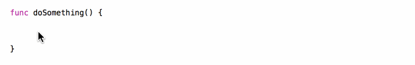
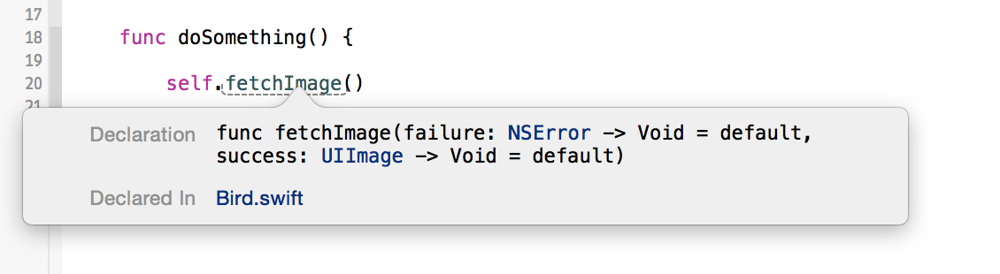
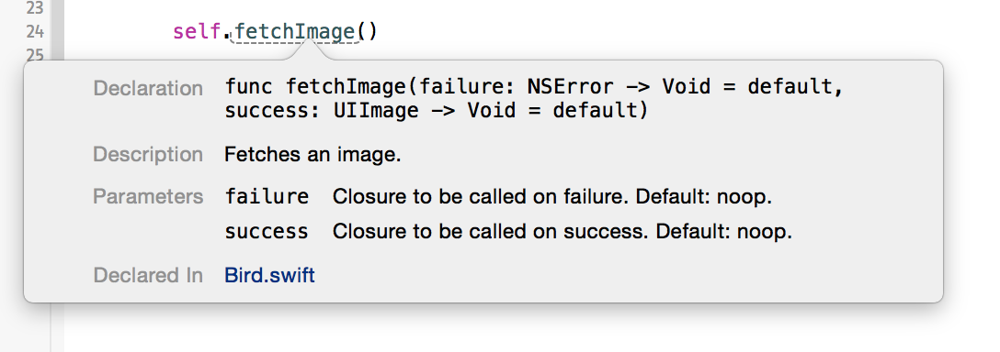
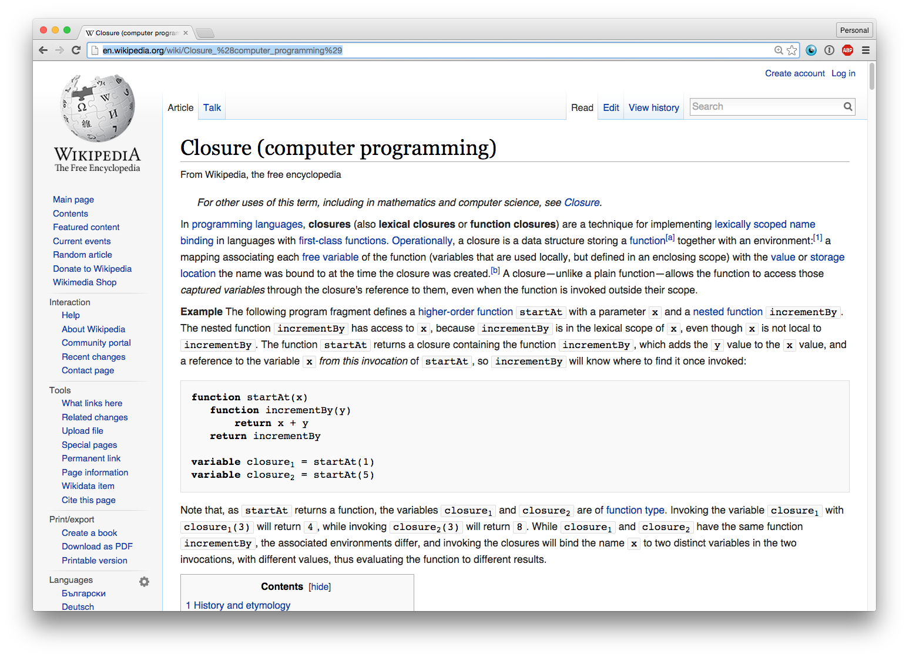

# Closures
## *In API design*
#### { @hpique }

^ Hi. My name is Hermes Pique and I love using closures in my APIs. 

^ I use them in my open source libraries RMStore and Haneke, and most recently at Facebook.

^ Today I'd like to share some of the things I learned about closures in Swift APIs.

---


^ First let's go back in time.

^ This is James Clerk. A physicist and mathematician who worked on closure theory. 

---


^ Clerk was also an ornithologist; he studied birds. 

^ In 1925 he had to pick a character to denotate closures. 

^ He choose the curly bracket because of this photograph.

^ So what do birds and closures have in common?

---

# Agenda

* Closures
* @autoclosure
* @noescape
* Default values


^ Nothing. I just made that up to have an excuse to use bird gifs.

^ And in between those gifs we're going to be talking about closures, the autoclosure and noescape attributes and the importance of default values.

---

# Closures are *self-contained* blocks of functionality

^ Let's recap what closures are. Closures are self-contained blocks of functionality.

---

# Using closures

```swift
func showButton() {
    UIView.animateWithDuration(0.5, animations: {
        self.button.alpha = 1
    }, completion: { finished in
        if finished {
            self.button.enabled = true
        }
    })
}
```

^ This is an example you might be familiar with.

^ animateWithDuration takes two closures. One to specify the animations, another to specify what to do when the animation finishes.

^ Closures are great for event callbacks like "animation completed". They're also useful to abstract implementation away. 

^ The animateWithDuration function doesn't need to know the specifics of the animations to perform or the specifics of what to do when the animation finishes.

---

# Trailing closures

```swift
func showButton() {
    UIView.animateWithDuration(0.5, animations: {
        self.button.alpha = 1
    }) { finished in
        if finished {
            self.button.enabled = true
        }
    }
}
```

^ Closures are widely used in Swift and as such have lots of syntax optimizations.

^ One of my favorites is the trailing closure which allows us to write the last closure outside of the function call parenthesis and without the parameter name.

---

# Closures *capture* the constants and variables used within

^ Another important characteristic of closures is that -unless told otherwise- they capture the constants and variables used within.

---


^ That means that in our example, self will be captured or retained by the closure until the completion closure executes.

^ This is made explicit by the compiler, who will complain if we don't use self to access instance variables.

---

# Before closures
### *UIAlertView*

^ Of course, closures are not strictly needed but they can make our code better.

^ Let's look at how we could show an alert with APIs designed before closures.

---

```swift
func showQuestionAlert() {
    questionAlert = UIAlertView(title: "Question",
        message: "Pigeons are the new cats?",
        delegate: self,
        cancelButtonTitle: nil,
        otherButtonTitles: "No", "Coo!")
    questionAlert.show()
}
```

^ You might be familiar with this code. We show an alert and we set a delegate on the alert to respond to events.

---

```swift
// MARK: UIAlertViewDelegate

func alertView(alertView: UIAlertView, 
    clickedButtonAtIndex buttonIndex: Int) {
    if (alertView === questionAlert) {
        switch buttonIndex { ... }
    }
}

func alertView(alertView: UIAlertView, 
    didDismissWithButtonIndex buttonIndex: Int) {
    if (alertView === questionAlert) {
    	questionAlert = nil
    }
}
```

^ The delegate approach has a couple of problems the first of which is requiring to keep a reference to the alert view in case we show more than one alert with the same delegate.

^ Also we need to match buttons with actions by way of the button index.

---

# After closures
### *UIAlertController*

^ Luckily iOS 7 introduced a closure-based API for alert views: UIAlertController.

---

```swift
func showQuestionAlert() {
    let controller = UIAlertController(title: "Question",
        message: "Pigeons are the new cats?",
        preferredStyle: .Alert)
    
    let no = UIAlertAction(title: "No", style: .Default) { _ in 
        ...
    }
    controller.addAction(no)

    let yes = UIAlertAction(title: "Coo!", style: .Default) { _ in 
        ...
    }
    controller.addAction(yes)
    
    self.presentViewController(controller, animated: true) { ... }
}
```

^ This is how the same functionality looks like by leveraging closures and trailing closure notation.

^ We create an alert controller. Then we create actions, each of which has a closure to respond to their selection. Finally we present the view controller with a closure to handle the completion.

^ This code has none of the problems of the previous method. What you see here is the result of code locality. All the work fits in a single function. 

---

# Closures encourage *code locality*

^ This is one of the greatest benefits of closures: they encourage code locality.

---

# Using closures in our APIs

^ By now we covered some of the benefits of closures. 

^ Let's dig deeper on how to use them in our APIs.

---

#@autoclosure


^ We begin with an attribute: autoclosure.

---

# Inneficient `and`

```swift
func getExpensiveBool() -> Bool {
    NSThread.sleepForTimeInterval(10.0)
    println("Birds!!!")
    return true
}

let result = and(false, getExpensiveBool())

> Birds!!!
```

^ To illustrate think of an inefficient implementation of logical and that evaluates both values. If the right hand value is expensive to procure,  we're doing more work than we need.

---

# Short-circuit with closures

```swift
func and(left: Bool, getRight : () -> Bool) -> Bool {
    if !left {
        return false
    }
    return getRight()
}

let result = and(false, { return getExpensiveBool() })

>
```

^ We can use closures to implement short-circuiting. 

^ We modify `and` to receive a closure that returns a boolean instead of a boolean directly.

^ Then we check the left value. If it's false, we simply return false. Only if the left value is true we check the right value.

^ This is great for performance, but a chore for the users of our API who would have to wrap the right value in a closure every time.

---

# Use *@autoclosure* for parameter values that might not be used

^ Enter autoclosure. We use this attribute for parameter values that might not be needed.

---

# Adding `@autoclosure`

```swift
func and(left: Bool, @autoclosure getRight: () -> Bool) -> Bool

let result = and(false, getExpensiveBool())

>
```

^ Using autoclosure is as simple as adding it to the relevant parameter.

^ And so the API user doesn't need to wrap the parameter in a closure anymore.

---

# `@autoclosure` in the Standard Library

```swift
func &&<T : BooleanType>(lhs: T, @autoclosure rhs: () -> Bool) -> Bool

func assert(@autoclosure condition: () -> Bool, 
            _ message: @autoclosure () -> String = default, 
        	file: StaticString = default, 
            line: UWord = default)

```

^ autoclosure is extensively used in the Standard Library.

^ The real `and` uses it. And so do assertions, which can be turned off and thus don't have to evaluate some of their arguments.

---

# @noescape


^ Another attribute of interest is noescape.

^ noescape was introduced recently in Swift 1.2.

---

# `Loop` with closure

```swift
func loop(duration: NSTimeInterval, 
          reverse: Bool, 
          animations: () -> Void)
```

^ To present noescape imagine we're implementing an animation framework and we have a loop function.

^ The function takes a duration, a flag for reversing and the animations it must perform.

---

# Using `loop`

```swift
class MYView: UIView  {
        
    func animate() {
        loop(duration: 0.5, reverse: true) {
            self.scale(1.25)
        }
    }
    
    func scale(scale: Double) { ... }
    
}
```

^ This is how we could use the loop function in a view. 

^ Here we tell the view to scale up and down every half second.

^ Notice that the animation closure is capturing self. 

---

# How long are we capturing *self*?


^ The question is: how long are we capturing self?

---

# What does `loop` do?

```swift
loop(duration: 0.5, reverse: true) {
	self.scale(1.25)
}
```

* Call `animations` on every cycle?
* Call once, take snapshots and animate between them?

^ It actually depends on the implementation of the loop function.

^ If loop calls the animations closure on every cycle, then we are effectively retaining self forever.

^ But if it only calls animations once, takes snapshots and then animates back and forth, then we are capturing `self` only for the duration of the loop function call.

^ Wouldn't it be great if we could tell the API user our intent with the animations closure? 

---

# Use *@noescape* for closure parameters that will not outlive the function call

^ We can with the noescape attribute. We use it for closure parameters that will not outlive the function call.

---

# Adding `@noescape`

```swift
func loop(duration: NSTimeInterval, 
          reverse: Bool, 
          @noescape animations: () -> Void)
```

^ Again, to use noescape we only need to add it to the corresponding closure parameter. 

^ Then the compiler will make sure we use the animation closure accordingly.

---

# No need for `self`

```swift
class MYView: UIView  {
    
    func doAnimations() {
        loop(duration: 0.5, reverse: true) {
            scale(1.25)
        }
    }
    
    func scale(scale: Double) { ... }
    
}
```

^ The compiler doesn't even need us to be explicit about self anymore as there are no capture risks involved.

---

# `@noescape` in the Standard Library

```swift
func reduce<U>(initial: U, 
    combine: @noescape (U, Self.Generator.Element) -> U) -> U
```

^ As a recent addition, the noescape attribute is not as widespread as autoclosure.

^ You can start seeing it in sequence functions such as reduce, which uses a closure to reduce a collection into a single value.

---

# *@autoclosure* implies *@noescape*


^ Speaking of autoclosure, it's worth mentioning that the autoclosure attribute implies noescape.

^ This is done explicitly to limit autoclosure usage to lazy evaluation.

---

# Forward compatibility

* Removing `@noescape` might break user code
* Only add if sure that the function will *never* call the closure asynchronously

^ Another thing to consider about noescape is forward compatibility.

^ Adding it has no negative consequences. But removing it might break user code as noescape closures can only be passed as noescape parameters.

^ Only add noescapae if you're if sure that the function will not change in the future and call the closure asynchronously

---

# Default values


^ Our last topic is default values for closure parameters.

---

# Event callbacks in objective-C

```objectivec
- (void)fetchImageWithSuccess:(void (^)(UIImage *image))successBlock 
                      failure:(void (^)(NSError *error))failureBlock;
```

^ We'll be using event callbacks as an example.

^ If you are an Objective-C developer, then you might be used to methods like this.

^ We fetch an image and provide a callback for success and a callback for error.

---

# Swift translation

```swift
func fetchImage(success: (UIImage -> Void)?, 
                failure: (NSError -> Void)?)

fetchImage(success: { image -> Void in
    save(image)
}, failure: nil)
```

^ In Swift that method could look like this. Shorter and sweet.

^ If you're interested in the differences in naming between Swift and Objective-C, don't miss Radek's talk tomorrow.

^ Back to our function, say we don't care about handling the failure case. With our current signature we are forced to specify nil for the failure.

---

# `nil` as default

```swift
func fetchImage(success: (UIImage -> Void)? = nil, 
                failure: (NSError -> Void)? = nil) {
	...
    if let success = success {
        success(image)
    }
}

fetchImage(success: { image -> Void in
    save(image)
})
```

^ Swift has default parameter values, and that applies to closures as well.

^ We could set the default value to nil. This is slightly inconvenient for the API developer because now we need to check if the closures are nil before calling them.

^ More importantly, it also makes the behavior of the function less clear. Can a `nil` value make the function act differently?

---

# No optionals

```swift
func fetchImage(success: UIImage -> Void, 
                failure: NSError -> Void)


fetchImage(success: { image -> Void in
    save(image)
}, failure: { _ in })
```

^ If we want to be explicit we could remove optionals altogether.

^ Now our fetch image function expects both closures. The behavior is quite clear, but the API became more inconvenient to use as the consumer must set the closure parameters they don't care about to an empty closure.

---

# Empty closure as default

```swift
func fetchImage(success: UIImage -> Void = { _ in }, 
                failure: NSError -> Void = { _ in }) {
	...
    success(image)
}

fetchImage(success: { image -> Void in
    save(image)
})
```

^ Luckily the default value can also be a closure, and particularly an empty closure.

^ Now both implementation and usage are delightful and there is no ambiguity, though the signature might be a bit harder to read.

---

# Global function as default

```swift
func fetchImage(success: UIImage -> Void = noop
                failure: NSError? -> Void = noop)
```

^ To make the intention of the default value more clear and simplify the signature, we can set the default to a global function whose name states exactly our intent. 

---

# Defining `noop`

```swift
func noop() {}

func noop<T>(value: T) {}
```

^ Using generics and overloading we can have global no-op function that works for any closure with and without a parameter.

---

# Defining `noop`

```swift
func noop() {}

func noop<T>(value: T) {}

func noop<T>() -> T? { return nil }
```

^ We can even make it work for closures that return an optional.

---

# Defining `noop`

```swift
func noop() {}

func noop<T>(value: T) {}

func noop<T>() -> T? { return nil }

func noop<T, S>(value: T) -> S? { return nil }
```

^ And closures that expect a parameter and return an optional.

---

# Trailing confusion

```swift
fetchImage() { _ in
    // What closure is this?
}
```


^ There's still an issue with our function signature. 

^ Remember the trailing closure? Guess which closure we are calling here?

^ Hint: it's not the success closure.

---

# Consider the *trailing closure* when defining parameter order


^ This means that it's important to consider the trailing closure when defining parameter order.

---

# Finally

```swift
func fetchImage(failure: NSError -> Void = noop,
                success: UIImage -> Void = noop)
```


^ So taking this into account, we switch the closure parameter order and we finally have a function signature we can be proud of.

---

# Damn you Xcode!



^ Sadly to date Xcode is totally incompetent at letting developers know about default values.

^ Not only it fails to tells us about them when using code completion.

---

# Damn you again Xcode!



^ It also doesn't tell us which is the default value when using Quick Documentation.

---

# Be mindful of how you API looks in *code completion* and *Quick Documentation*

---

# Compensating with documentation

```swift
/// Fetches an image.
///
/// :param: failure Closure to be called on failure. Default: noop.
/// :param: success Closure to be called on success. Default: noop.
func fetchImage(failure: NSError -> Void = noop,
    success: UIImage -> Void = noop)
```



^ Thus for now it's important to compensate with good code documentation that specifies the default values.

---

### Closures encourage *code locality*
### Use *@autoclosure* for parameter values that might not be used
### Use *@noescape* for closure parameters that will not outlive the function call

--- 

### Prefer *no-op closures* as default values for closure parameters
### Consider the *trailing closure* when defining parameter order
### Be mindful of how consumers will *discover* your APIs

^ To sum up:

---

# Coming next

```swift
fetchImage().onSuccess { image in
    save(image)
}.onFailure { error in
    handle(error)
}
```

^ There are other ways in which we could have defined our fetchImage fuction. I would argue that this is a bit nicer to use than the version before.

^ In the next talk Javi will show us how to write functions that allow fluent code like this using futures.

---

# BCPL: the origin of `{}`

```
GET "libhdr"

LET start() = VALOF
$( writes("Hello, World!*n")
   RESULTIS 0
$)
```

Created by Martin Richards in 1966.

^ And regarding the origin of the curly brackets as block delimiters.

^ Internet research tells me that it comes from a language called BCPL created by Martin Richards of the University of Cambridge in 1966.

^ BCPL introduced the curly bracket notation but in practice used a dollar sign and parenthesis due to typographical limitations of the time.

^ It went on to inspire B and C, which in turn influenced most modern languages.

---

# Thank you!

Questions?


---

# Needs more Swift



^ One more thing. This is the Wikipedia page for closures. 

^ It has a section for many popular languages, including Objective-C. But no mention of Swift.

^ I encourage us to fix it this weekend.